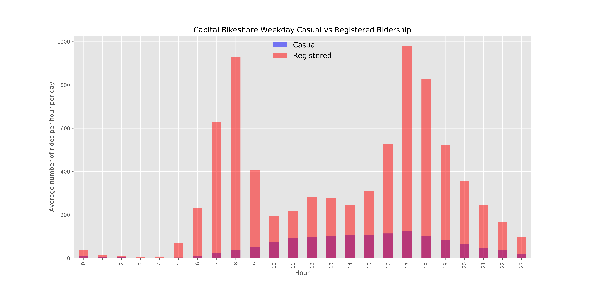

## Analysis of the impact of metro station location on commuter bikeshare habits
[Capital Bikeshare](https://www.capitalbikeshare.com/system-data) makes its data available to download in quarterly files. For this analysis I downloaded every trip for the most recently available year.

We see that approximately 80% of all rides are from registered users.

Member Type | Population
:---: | :---:
Casual | 628,777 
Registered | 2,520,541 

<br>

We can further slice this data up into weekdays or weekends.
```python
bikeshare_weekday = bikeshare_rides[bikeshare_rides['Day'].str[0].isin(list('MTWF'))]
bikeshare_weekend = bikeshare_rides[~bikeshare_rides['Day'].str[0].isin(list('MTWF'))]
```


<br><br><br>


<br><br><br>


<br><br><br>


<br><br><br>


<br><br><br>


<br><br><br>


Using the `vincenty` function available in the `geopy` package, I then determined which of these stations are within 0.15 miles of a metro station.

Most Popular Morning Rush hour Routes Among Registered Riders | Count
:--- | :---:
8th & F St NE to Columbus Circle / Union Station                                                    |1783
11th & H St NE to Columbus Circle / Union Station                                                   |1684
Columbus Circle / Union Station to M St & New Jersey Ave SE                                         |1526
13th & D St NE to Columbus Circle / Union Station                                                   |1497
Columbus Circle / Union Station to USDA / 12th & Independence Ave SW                                |1464
Carroll & Ethan Allen Ave to Takoma Metro                                                           |1341
Lincoln Park / 13th & East Capitol St NE  to Eastern Market Metro / Pennsylvania Ave & 7th St SE    |1320
Columbus Circle / Union Station to 4th & E St SW                                                    |1294
D St & Maryland Ave NE to Columbus Circle / Union Station                                           |1291
15th & F St NE to Columbus Circle / Union Station                                                   |1274

<br>

Most Popular Evening Rush hour Routes Among Registered Riders | Count
:--- | :---:
Columbus Circle / Union Station to 8th & F St NE                                                    |2456
Columbus Circle / Union Station to 11th & H St NE                                                   |1499
Eastern Market Metro / Pennsylvania Ave & 7th St SE to Lincoln Park / 13th & East Capitol St NE     |1427
Columbus Circle / Union Station to 6th & H St NE                                                    |1265
Columbus Circle / Union Station to 13th & H St NE                                                   |1255
Columbus Circle / Union Station to 13th & D St NE                                                   |1220
Columbus Circle / Union Station to 15th & F St NE                                                   |1195
L'Enfant Plaza / 7th & C St SW to Columbus Circle / Union Station                                   |1112
Eastern Market Metro / Pennsylvania Ave & 7th St SE to 13th & D St NE                               |1083
USDA / 12th & Independence Ave SW to Columbus Circle / Union Station                                |1069

<br>

Most Popular Weekday Routes Among Casual Riders | Count
:--- | :---:
Jefferson Dr & 14th St SW to Jefferson Dr & 14th St SW                                                  | 4007
Jefferson Dr & 14th St SW to Lincoln Memorial                                                           | 3650
Lincoln Memorial to Jefferson Memorial                                                                  | 3243
Lincoln Memorial to Jefferson Dr & 14th St SW                                                           | 3036
Lincoln Memorial to Lincoln Memorial                                                                    | 2712
Jefferson Memorial to Lincoln Memorial                                                                  | 1696
Ohio Dr & West Basin Dr SW / MLK & FDR Memorials to Ohio Dr & West Basin Dr SW / MLK & FDR Memorials    | 1595
Jefferson Memorial to Jefferson Dr & 14th St SW                                                         | 1328
Jefferson Dr & 14th St SW to Jefferson Memorial                                                         | 1311
Lincoln Memorial to Ohio Dr & West Basin Dr SW / MLK & FDR Memorials                                    | 1139

This map shows metro stations (red) and those bikeshare stations which were considered *near* to a metro station. Clicking on the image will load an interactive map that you can explore!

<a href="metro_nearbikes_map.html
" target="_blank"></a>


<br><br><br><br><br><br><br><br>


This map shows all stations, both metro and bikeshare that were used in this analysis. Green flags indicate metro stations, red flags indicate bikeshare stations considered near metro stations, and blue flags bikeshare stations considered far. For this analysis 0.15 miles was used as the cutoff between near and far. Clicking on the image will load an interactive map that you can explore!

<a href="all_stations_map.html
" target="_blank"></a>


```python
fig, ax = plt.subplots(figsize=[6, 4])
ax.set_ylabel('Average number of rides per hour per day')
ax.set_title('Capital Bikeshare Weekend Ridership')
(bikeshare_weekend.groupby('Hour')['Hour'].count() / weekend_days).plot(kind='bar',alpha=0.5, color='r', ax=ax)
plt.show()
```


---
#### Complete analysis
All code used for data collection, cleaning, and analysis is available in a [jupyter notebook](https://github.com/dandtaylor/MetroShare/blob/master/Analysis_metro_bikeshare_commuters.ipynb). 

#### Data sources
[WMATA api](https://developer.wmata.com/docs/services/)  
[OpenDataDC](http://www.opendatadc.org/dataset/wmata-disruption-reports)  
[Capital Bikeshare](https://www.capitalbikeshare.com/system-data)  

---

Whenever you commit to this repository, GitHub Pages will run [Jekyll](https://jekyllrb.com/) to rebuild the pages in your site, from the content in your Markdown files.

For more details see [GitHub Flavored Markdown](https://guides.github.com/features/mastering-markdown/).

### Jekyll Themes

Your Pages site will use the layout and styles from the Jekyll theme you have selected in your [repository settings](https://github.com/dandtaylor/MetroDelayBikeShare/settings). The name of this theme is saved in the Jekyll `_config.yml` configuration file.

### Support or Contact

Having trouble with Pages? Check out our [documentation](https://help.github.com/categories/github-pages-basics/) or [contact support](https://github.com/contact) and we’ll help you sort it out.
