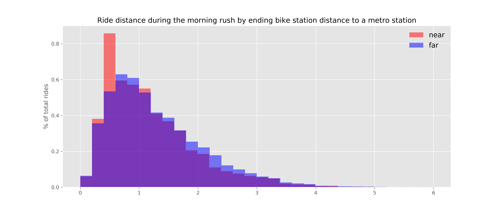
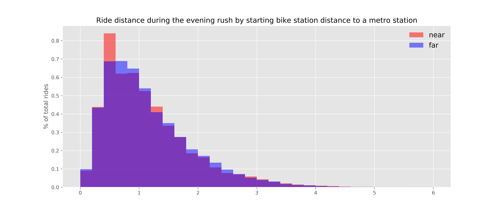
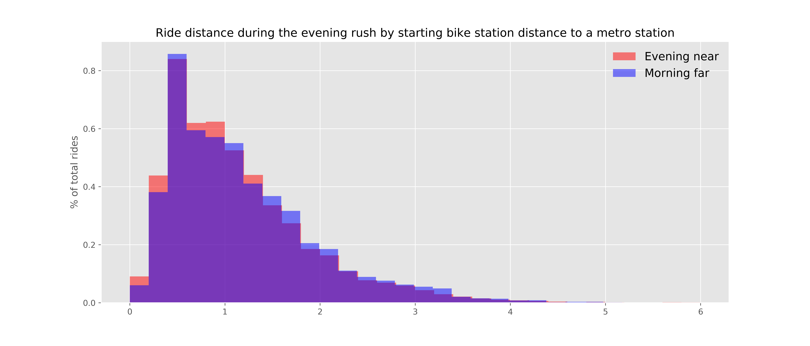
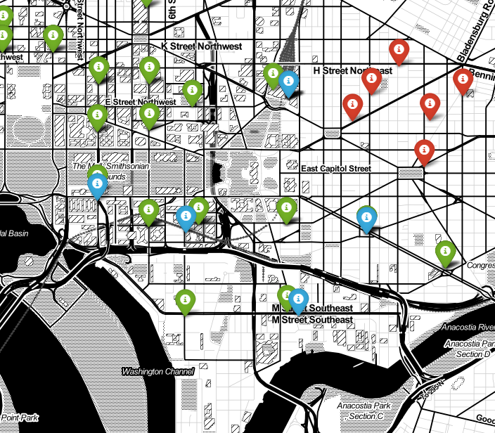
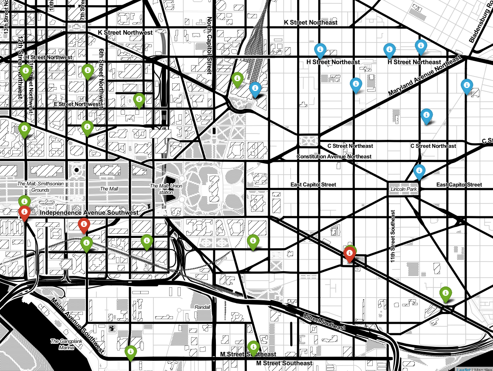
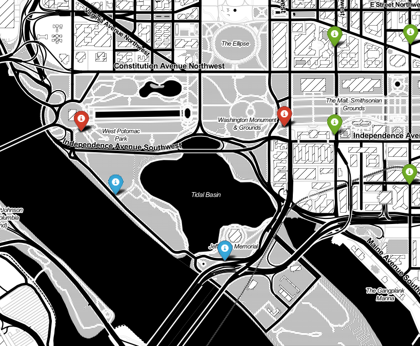
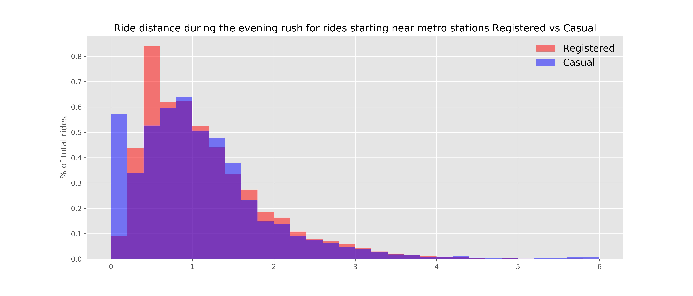
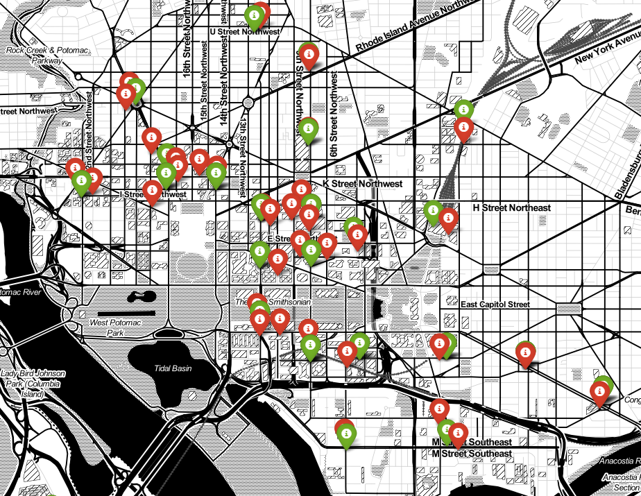
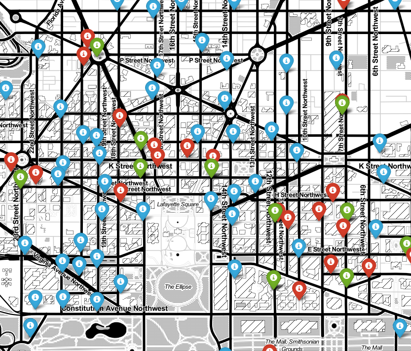

## Analysis of the impact of metro station location on commuter bikeshare habits
[Capital Bikeshare](https://www.capitalbikeshare.com/system-data) makes its data available to download in quarterly files. For this analysis I downloaded every trip for the most recently available year (2015-Q4 through 2016-Q3). The metro stop location data was obtained from the [WMATA API](https://developer.wmata.com/docs/services/) and the bike share station locations were obtained from the Capital Bikeshare station status [XML feed](https://feeds.capitalbikeshare.com/stations/stations.xml).

By considering both Capital Bikeshare and Metro stop data sets together, we can assess how ridership, and ultimately membership, is affected by the location of metro stations under the assumption that many commuters use the two services together to get to and from work everyday. Through this analysis, and our better understanding of the behavior of riders, we can hopefully increase ridership through a targeted expansion of bike share coverage.

Throughout this analysis I used multiple python libraries – namely pandas, pickle, matplotlib, scipy, geopy, and folium.

It is valuable to initially understand some of the larger trends in the bike share data. By slicing the data by day of the week, and then further by hour, we see that the weekday data has two large spikes associated with the morning and evening rush hour (centered on 8AM and 5PM). 

 
 
By doing some quick comparisons of the slice sizes, we see that about 74% of rides occur during the work week and about 80% are from registered riders (those with a long term membership). 
 
Member or Day Type | Population
:---: | :---:
Casual | 628,777 
Registered | 2,520,541 
Weekday | 2,333,344 
Weekend | 815,974

  

---
## Considering Bikeshare station location and route distance

By merging the bike share station location and bike share ridership data we can calculate the distance of each bike share station to each metro station (using the `vincenty` function available in the `geopy` package). We can then create flags for if a ride began, or ended at a bike share station within 0.15 miles of a metro station.

We see that there is a spike right around 0.5 miles for rides concluding near metro stations during the morning rush or beginning near one during the evening rush. This spike is not present in rides in the opposite directions nor those further away from metro stations, and is therefore a strong indication that many commuters are using the bike sharing service to travel approximately half of a mile to the nearest metro station in the morning, and then away from the metro at night.

   

   

This plot of ride distances shows the similarity in distribution between trips going towards the metro in the morning and away from the metro at night. The same spike at around 0.5 miles is present in both data sets.
 

   
---
## Route popularity

We can support this observation by looking at the most popular routes during each time period both as tables and through mapping. By considering the 10 most popular routes during the morning rush, we can see that many of them began in Northeast DC and ended near the union station metro stop. Then, during the evening rush hour, the trend is reversed as all of the most popular trips originate near metro stations and many of them end in the Northeast region.  

Furthermore, T-tests comparing ridership in the morning vs. the evening support the hypothesis that people are riding towards the metro in the morning and away from the metro at night (with 99% confidence). 

Most Popular Morning Rush Hour Routes Among Registered Riders | Count
:--- | :---:
8th & F St NE to Columbus Circle / Union Station                                                    |1783
11th & H St NE to Columbus Circle / Union Station                                                   |1684
Columbus Circle / Union Station to M St & New Jersey Ave SE                                         |1526
13th & D St NE to Columbus Circle / Union Station                                                   |1497
Columbus Circle / Union Station to USDA / 12th & Independence Ave SW                                |1464
Carroll & Ethan Allen Ave to Takoma Metro                                                           |1341
Lincoln Park / 13th & East Capitol St NE  to Eastern Market Metro / Pennsylvania Ave & 7th St SE    |1320
Columbus Circle / Union Station to 4th & E St SW                                                    |1294
D St & Maryland Ave NE to Columbus Circle / Union Station                                           |1291
15th & F St NE to Columbus Circle / Union Station                                                   |1274

 
### Morning rush hour's most popular stations and routes map

 

The above map indicates the locations of metro stations (green flags), the most popular morning rush hour starting stations (red flags), and the most popular morning rush hour ending stations (blue flags). Clicking on the image will load an interactive map.
   

Most Popular Evening Rush Hour Routes Among Registered Riders | Count
:--- | :---:
Columbus Circle / Union Station to 8th & F St NE                                                    |2456
Columbus Circle / Union Station to 11th & H St NE                                                   |1499
Eastern Market Metro / Pennsylvania Ave & 7th St SE to Lincoln Park / 13th & East Capitol St NE     |1427
Columbus Circle / Union Station to 6th & H St NE                                                    |1265
Columbus Circle / Union Station to 13th & H St NE                                                   |1255
Columbus Circle / Union Station to 13th & D St NE                                                   |1220
Columbus Circle / Union Station to 15th & F St NE                                                   |1195
L'Enfant Plaza / 7th & C St SW to Columbus Circle / Union Station                                   |1112
Eastern Market Metro / Pennsylvania Ave & 7th St SE to 13th & D St NE                               |1083
USDA / 12th & Independence Ave SW to Columbus Circle / Union Station                                |1069

 
### Evening rush hour's most popular stations and routes map

 
The above map indicates the locations of metro stations (green flags), the most popular evening rush hour starting stations (red flags), and the most popular evening rush hour ending stations (blue flags). Clicking on the image will load an interactive map.
   

## Non-rush hour patterns
To futher convince ourselves that there is a real pattern with commuter riders, lets compare our above findings to ridership patterns of casual riders on the same days. The below table and map show that the most popular casual rider routes are all around the National Mall near the Lincoln, Jefferson, and Washington monuments. Also, looking at the distribution of ride distances, we see that a large portion of the trips have 0 miles traveled indicating that these trips both began and ended at the same bike share station. These findings support the notion that casual riders are usual people using the bike share program to explore the more touristy areas of the city.

 

Most Popular Weekday Routes Among Casual Riders | Count
:--- | :---:
Jefferson Dr & 14th St SW to Jefferson Dr & 14th St SW                                                  | 4007
Jefferson Dr & 14th St SW to Lincoln Memorial                                                           | 3650
Lincoln Memorial to Jefferson Memorial                                                                  | 3243
Lincoln Memorial to Jefferson Dr & 14th St SW                                                           | 3036
Lincoln Memorial to Lincoln Memorial                                                                    | 2712
Jefferson Memorial to Lincoln Memorial                                                                  | 1696
Ohio Dr & West Basin Dr SW / MLK & FDR Memorials to Ohio Dr & West Basin Dr SW / MLK & FDR Memorials    | 1595
Jefferson Memorial to Jefferson Dr & 14th St SW                                                         | 1328
Jefferson Dr & 14th St SW to Jefferson Memorial                                                         | 1311
Lincoln Memorial to Ohio Dr & West Basin Dr SW / MLK & FDR Memorials                                    | 1139

  
The below map indicates the locations of metro stations (green flags), the most popular casual rider midweek starting stations (red flags), and the most popular casual rider midweek ending stations (blue flags). Few of these red and blue flags are visible because of the overlap between the stations in each of these routes. Clicking on the image will load an interactive map.
 

 

 

---

## Metro stop and Bikeshare station maps used for this analysis

This map shows metro stations (red) and those bikeshare stations which were considered *near* to a metro station (within 0.15 miles). Clicking on the image will load an interactive map that you can explore!

 

This map shows all stations, both metro and bikeshare that were used in this analysis. Green flags indicate metro stations, red flags indicate bikeshare stations considered near metro stations, and blue flags indicate bikeshare stations considered far from metro stations. For this analysis 0.15 miles was used as the cutoff between near and far. Clicking on the image will load an interactive map that you can explore!

 

---
#### Complete analysis
All code used for data collection, cleaning, and analysis is available in a [jupyter notebook](https://github.com/dandtaylor/MetroShare/blob/master/Analysis_metro_bikeshare_commuters.ipynb).  
All notebooks used for data cleaning and *most* data is available in the repository [code tab](https://github.com/dandtaylor/MetroShare).

#### Data sources
[WMATA api](https://developer.wmata.com/docs/services/)  
[OpenDataDC](http://www.opendatadc.org/dataset/wmata-disruption-reports)  
[Capital Bikeshare](https://www.capitalbikeshare.com/system-data)  
[Capital Bikeshare XML feed](https://feeds.capitalbikeshare.com/stations/stations.xml)

---
