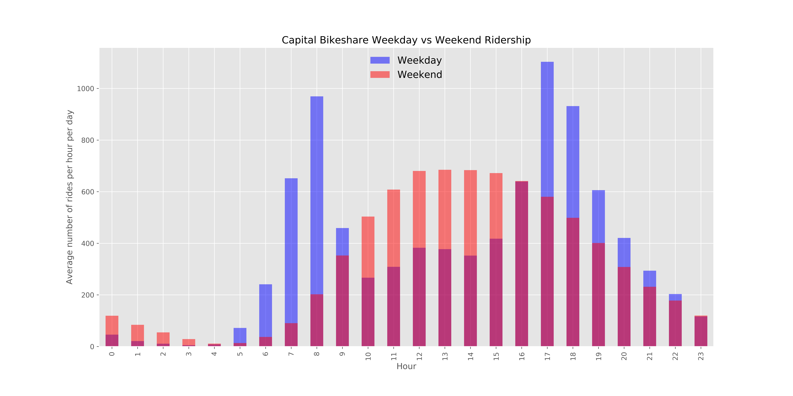

## Welcome to GitHub Pages

You can use the [editor on GitHub](https://github.com/dandtaylor/MetroDelayBikeShare/edit/master/README.md) to maintain and preview the content for your website in Markdown files.

Click [here](https://github.com/dandtaylor/MetroShare/blob/master/Analysis_metro_bikeshare_commuters.ipynb) to download my analysis notebook where all of my code is shown

the new [map of the redline stations used in analysis](map_red.html)!



<a href="metro_nearbikes_map.html
" target="_blank"></a>


#### Data sources
WMATA api  
DCopendata  
Capital Bikeshare  


  

Whenever you commit to this repository, GitHub Pages will run [Jekyll](https://jekyllrb.com/) to rebuild the pages in your site, from the content in your Markdown files.

### Markdown

Markdown is a lightweight and easy-to-use syntax for styling your writing. It includes conventions for

```markdown
Syntax highlighted code block

# Header 1
## Header 2
### Header 3

- Bulleted
- List

1. Numbered
2. List

**Bold** and _Italic_ and `Code` text

[Link](url) and 
```

For more details see [GitHub Flavored Markdown](https://guides.github.com/features/mastering-markdown/).

### Jekyll Themes

Your Pages site will use the layout and styles from the Jekyll theme you have selected in your [repository settings](https://github.com/dandtaylor/MetroDelayBikeShare/settings). The name of this theme is saved in the Jekyll `_config.yml` configuration file.

### Support or Contact

Having trouble with Pages? Check out our [documentation](https://help.github.com/categories/github-pages-basics/) or [contact support](https://github.com/contact) and we’ll help you sort it out.
